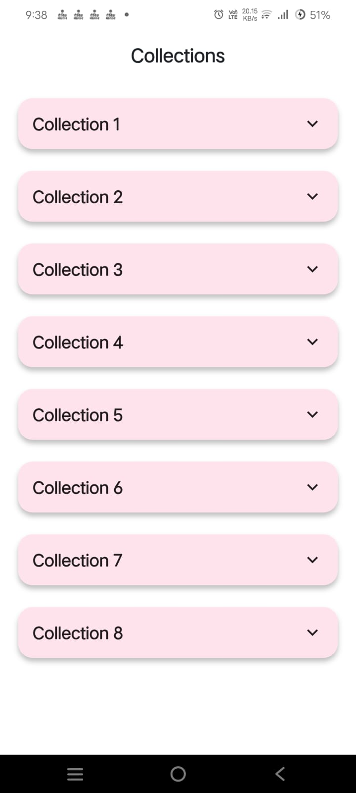
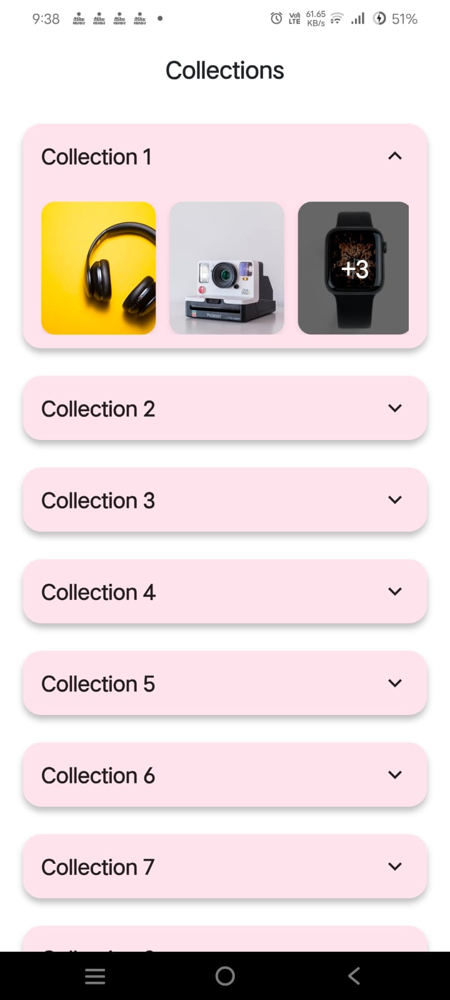

# 📦 Accordion Collections Flutter App

An elegant accordion-style product collections UI built using Flutter, featuring smooth animations, responsive layouts, and optimized image handling.

## 🚀 Features

- 📱 Accordion-style expandable/collapsible collection cards
- 🎨 Smooth animations for expansion/collapse
- 🖼️ Horizontal product image preview with +N overlay
- 📦 Grid layout for expanded product images
- ⚡ Only one collection expanded at a time
- 🔄 Network image loading with placeholders & error handling
- 🧩 Clean widget structure and maintainable code
- 📱 Fully responsive UI

## 📁 Project Structure

```
lib/
├── main.dart                        # App entry point
├── screen/
│     └── collection_screen.dart    # Main UI with state management
├── widget/
│     └── collection_card.dart       # Reusable collection card widget
├── models/
│     └── collection_model.dart      # Data model
└── data/
      └── collections_data.dart      # Mock data source
```

## 🔑 Key Implementation Details

### 🧠 State Management
- Local state handled using `setState`
- Tracks expandedCollectionId for single expansion
- Collection data is kept immutable

### 🎞️ Animations
- `AnimationController` for height transitions
- `AnimatedRotation` for arrow icon animation
- `Curves.easeInOut` for smooth feel throughout

### 🖼️ Image Handling
- Loads images from Unsplash
- `CircularProgressIndicator` for loading
- Error icon fallback
- +N overlay for hidden images

### 🎨 UI Components
- Custom `CollectionCard` widget
- Material cards with rounded corners (16px)
- 2-column responsive grid inside expanded view

## 🛠️ Getting Started

### 1️⃣ Clone the repository
```bash
git clone <[repository-url](https://github.com/agharsh53/flutter-accordion-collections)>
cd collection_flow
```

### 2️⃣ Install dependencies
```bash
flutter pub get
```

### 3️⃣ Run the app
```bash
flutter run
```

## 📌 Requirements

- Flutter SDK 3.10.7
- Dart 3.10.7+
- Internet connection for images

## 📸 Screenshot
Add images after uploading to:
```
assets/screenshots/
```

---

## 📸 Screenshots
|                                                 |                                                |
|:-----------------------------------------------:|:----------------------------------------------:|
|   |    |

---

## ⚡ Performance Considerations

- Uses ListView.builder for efficient rendering
- Async image loading
- Optimized animations
- Grid uses ScrollableScrollPhysics

## 🧪 Testing
```bash
flutter test
```

## 🔮 Future Enhancements

- Pull-to-refresh
- Search/filter
- Favorites
- Landscape support
- API integration
- Offline caching

## ▶️ How to Run From Scratch
```bash
flutter create collection_flow
```
Replace files → update pubspec.yaml → run:
```bash
flutter run
```

## ⭐ Conclusion
A clean, maintainable, production-ready Flutter UI demonstrating strong animation, architecture, and responsive design practices.
